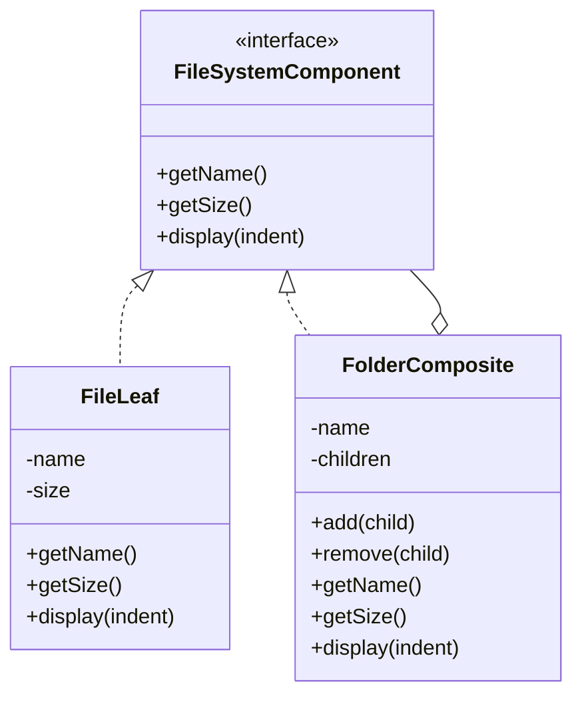
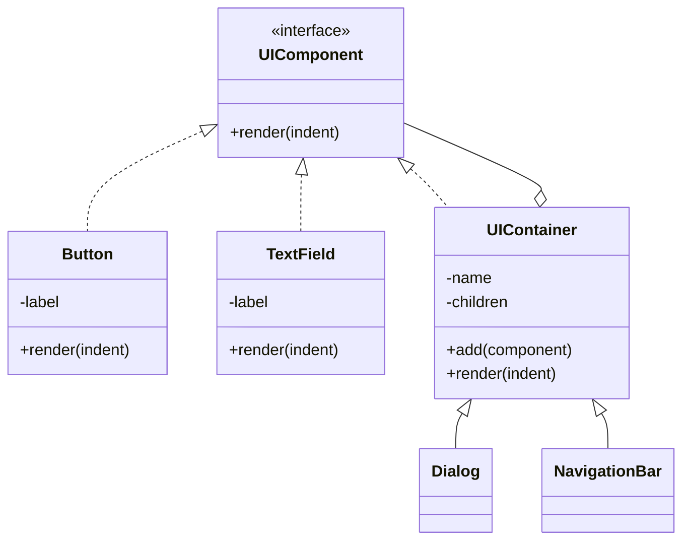
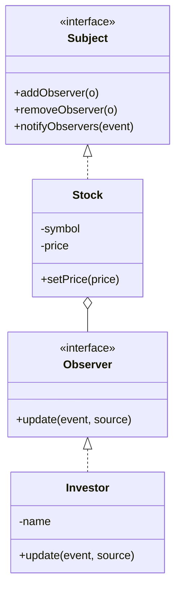
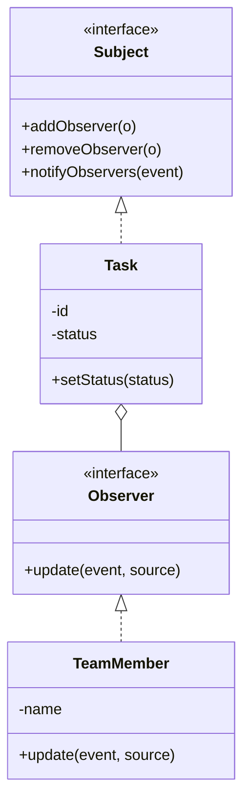
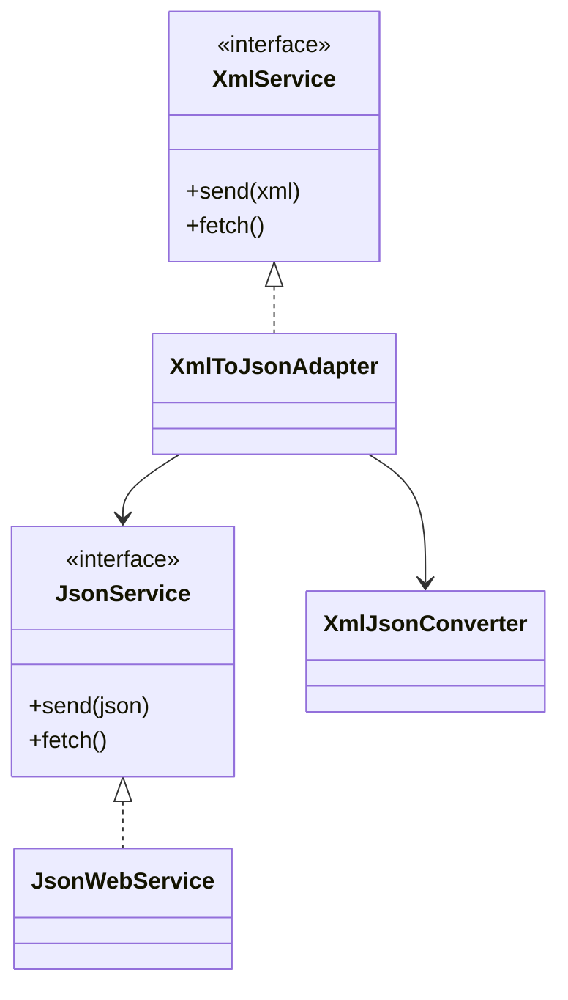
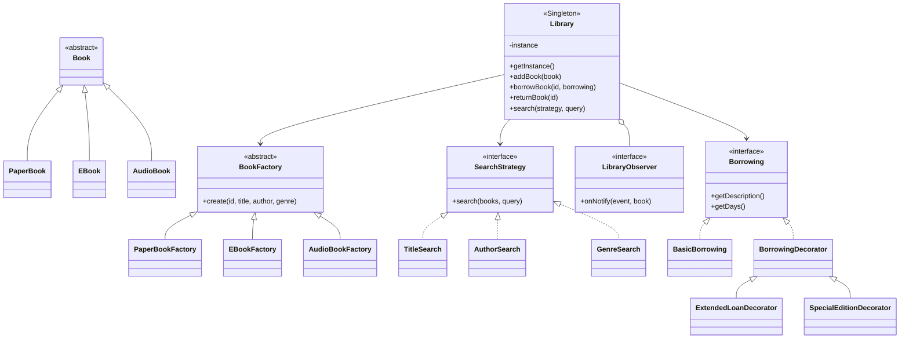

# Tuan03 - Design Patterns Practice

This folder contains examples for Composite, Observer, Adapter, and a Library System that combines multiple patterns. Diagrams come before code as requested.

## Composite Pattern (File System)



## Composite Pattern (UI Components)



## Observer Pattern (Stock Price)



## Observer Pattern (Task Status)



## Adapter Pattern (XML <-> JSON)



## Library System (Multiple Patterns)



## Run Examples

```bash
# from Tuan03
javac -d out $(find src -name "*.java")
java -cp out com.patterns.composite.FileSystemDemo
java -cp out com.patterns.composite.UIDemo
java -cp out com.patterns.observer.ObserverDemos
java -cp out com.patterns.adapter.AdapterDemo
java -cp out com.patterns.library.LibraryDemo
```
